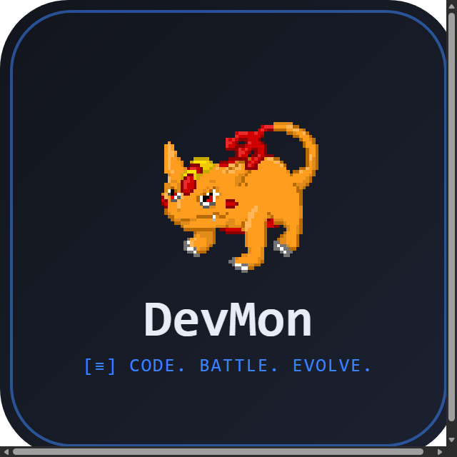
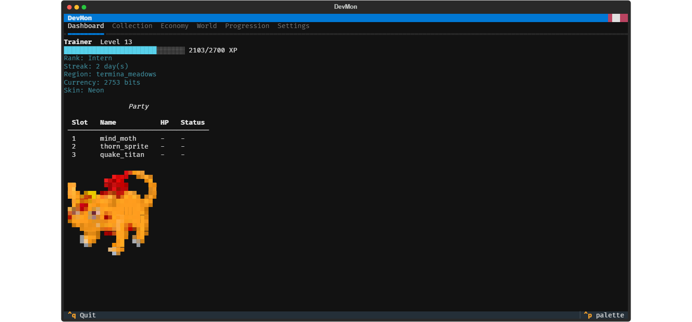
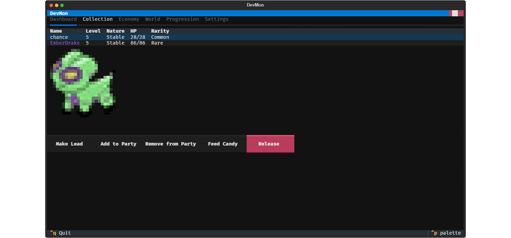
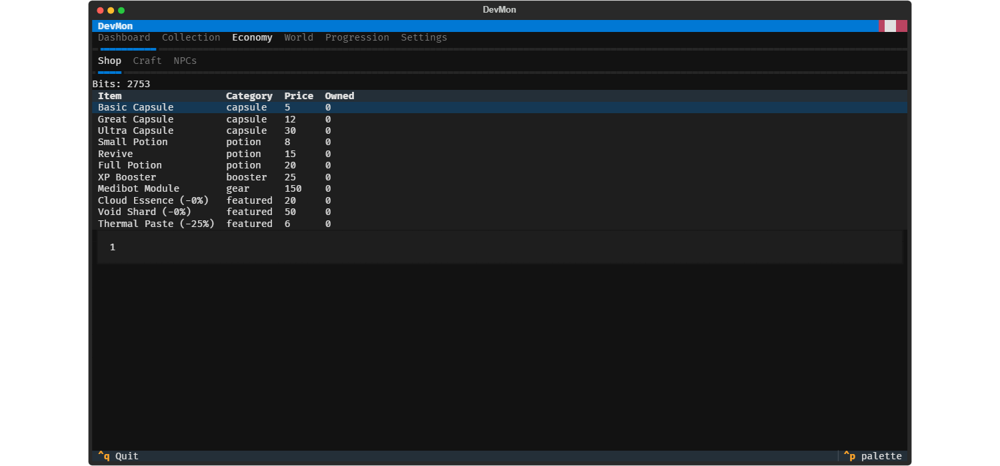
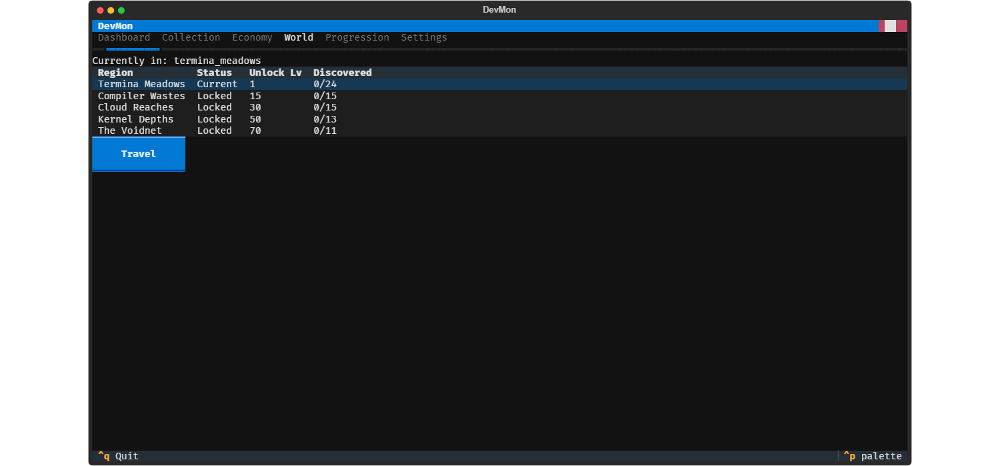

<p align="center">
  
</p>

<h1 align="center">DevMon</h1>

**Coding should feel rewarding.** DevMon is a gamified terminal experience
where your real coding activity powers a creature-collection RPG. As you
work, you earn XP, encounter wild DevMon, battle or capture them, and build
a personal collection — the terminal becomes a living game world layered
over your actual development work, and it never blocks or slows you down.


## Features

- **Statusline XP tracking** — a live DevMon row in your Claude Code (or
  any) statusline, tracking XP and encounters as you work
- **Turn-based auto-battle** — engage wild encounters with a queued,
  turn-based battle system
- **78 creatures across 5 regions** — Termina Meadows, Compiler Wastes,
  Cloud Reaches, Kernel Depths, and the Voidnet, each with its own roster
  and level band (see [docs/STORY.md](docs/STORY.md) for the lore)
- **Crafting, marketplace, and NPCs** — recipes, a shop with sell-back,
  candy feeding, and in-town NPCs with their own stock and deals
- **Collection, party, and badges** — a full creature codex, 3-slot active
  party, rename/release, rank badges, and a perk tree with prestige
- **Full-screen Textual app** — `devmon play` opens a dedicated full-screen
  TUI in its own terminal window, so your working terminal stays free
- **Cosmetic skins** — equip and preview terminal themes and particle
  styles

## Screenshots

| Dashboard | Collection |
|---|---|
|  |  |

| Economy | World |
|---|---|
|  |  |

## Quickstart

```bash
# Install the CLI (editable, for development)
uv tool install --editable .

# Wire up shell hooks so terminal activity earns XP
devmon hook install

# Open the full-screen app in its own window
devmon play
```

## Command reference

| Command | Purpose | Example |
|---|---|---|
| `statusline` | Print the DevMon row for a statusline (plain, no Rich) | `devmon statusline` |
| `status` | Show player profile summary | `devmon status` |
| `hook install` / `hook uninstall` | Manage DevMon shell hooks | `devmon hook install` |
| `track test-pass` | Manually record a test-pass event for bonus XP | `devmon track test-pass` |
| `prompt` | Output a PS1-safe prompt annotation string | `devmon prompt` |
| `settings` | View or change settings (theme, auto-fight/skip/discard) | `devmon settings --theme neon` |
| `encounter` | Inspect and act on the current wild encounter | `devmon encounter` |
| `battle` | Engage the queued wild encounter in turn-based battle | `devmon battle` |
| `party` / `party swap` | Show or edit the active 3-slot party | `devmon party swap 1 bugbyte` |
| `collection` / `show` / `rename` / `codex` / `release` | View and manage your creature collection | `devmon collection codex` |
| `shop` / `shop sell` | Browse, buy, or sell items | `devmon shop --buy small_potion` |
| `items` | View inventory, use an item outside battle | `devmon items --use xp-booster` |
| `heal` | Team HP status, use a potion, or free Repo Center heal | `devmon heal --center` |
| `candy` / `candy feed` | View and feed candy to a creature | `devmon candy feed bugbyte` |
| `quests` | View active quests and progress | `devmon quests` |
| `achievements` | View achievements and progress | `devmon achievements` |
| `craft` | List recipes, or craft a recipe by id | `devmon craft recipe_great_capsule` |
| `npcs` / `visit` / `buy` / `quest` | See who's in town, visit, buy, turn in fetch quests | `devmon npcs visit skye` |
| `travel` | Show the region table, or travel to a region | `devmon travel compiler_wastes` |
| `badges` | Show the badge board and current rank | `devmon badges` |
| `perks` / `perks buy` | Show and spend points on the perk tree | `devmon perks buy speed_1` |
| `prestige` | Reset level/XP for a permanent XP multiplier | `devmon prestige` |
| `indicator start` / `stop` / `status` | Manage the background indicator daemon | `devmon indicator start` |
| `protocol install` / `uninstall` / `status` | Manage the `devmon://` URL protocol (Windows) | `devmon protocol install` |
| `skins` / `equip` / `preview` | List, equip, and preview cosmetic skins | `devmon skins equip neon` |
| `app` | Launch the full-screen Textual app in this terminal | `devmon app` |
| `play` | Open the app in a new terminal window and return immediately | `devmon play` |

Run `devmon --help` or `devmon <command> --help` for the full, current set
of flags — this table is generated from that output and may lag a beat
behind brand-new flags.

## License

[MIT](LICENSE) — Copyright (c) 2026 HockeyBen MacDonald
